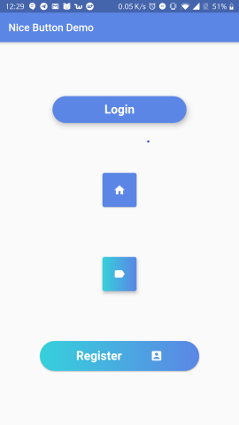

# nice_button


A Flutter package for Android and IOS to design nice buttons with no hassle in your app. Enjoy !

## Installation

Add the following to pubspec.yaml
```yaml
dependencies:
  ...
  nice_button: ^0.1.1.1
```

## Usage Example

import nice_button.dart

```dart
import 'package:nice_button/NiceButton.dart';
```

### For normal buttons

```dart
NiceButton(
    width: 255,
    elevation: 8.0,
    radius: 52.0,
    text: "Login",
    background: yourColor,
    onPressed: () {
        print("hello");
        },
    ),
```

### For mini buttons

Icon is required in this case

```dart
NiceButton(
    mini: true,
    icon: Icons.home,
    background: yourColor,
    onPressed: () {
        print("hello");
    },
    )
```


### For gradient buttons

```dart
var firstColor = Color(0xff5b86e5), secondColor = Color(0xff36d1dc);

NiceButton(
    radius: 40,
    padding: const EdgeInsets.all(15),
    text: "Register",
    icon: Icons.account_box,
    gradientColors: [secondColor, firstColor],
    onPressed: () {},
    )
```




**Refer to [example folder](example/README.md) and the source code for more information.**
